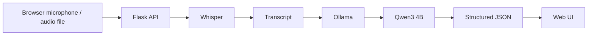

# VoxBuddy 🎙️

**Turn messy voice notes into things you can act on — privately, with local open AI.**

VoxBuddy was built for a friend who records lots of voice notes but rarely revisits them. Instead of sending those recordings to a cloud AI API, VoxBuddy keeps the AI pipeline on the user's machine:

**Voice note → Whisper → transcript → Qwen3 → summary + tasks + important details**

## Why this project exists

A voice note is easy to record and surprisingly easy to forget.

VoxBuddy takes the few seconds your friend already spends speaking and turns them into something actionable:

- A short summary
- Clear tasks
- Priority levels
- Deadlines when they were actually mentioned
- The original transcript for verification

The goal is not to create another general-purpose chatbot. It is a tiny tool built around one real person's habit.

## Why open AI matters here

The most important design choice is that the sensitive audio stays local.

VoxBuddy uses:

- **OpenAI Whisper** for speech recognition. Whisper's code and model weights are released under the MIT License. It supports multilingual speech recognition and language identification. [Whisper](https://github.com/openai/whisper)
- **Qwen3 4B through Ollama** for local text analysis. The `qwen3:4b` Ollama package is a 4.02B-parameter Q4_K_M model and is listed under the Apache License 2.0. [Qwen3 4B on Ollama](https://ollama.com/library/qwen3:4b)
- **Ollama** as the local model runtime/API. [Ollama](https://ollama.com/)

After the models have been downloaded, the actual processing path can run without sending the user's voice note to a remote AI API.

That is the point of using open components here: **privacy is not a product promise layered on top of a hosted API; it is an architectural choice.**

## Features

- 🎙️ Record directly in the browser
- 📁 Upload existing audio
- 🗣️ Automatic speech transcription
- 🧠 Local LLM summarization
- ✅ Task extraction
- 🚦 High / medium / low task priority
- 📅 Deadline extraction when explicitly mentioned
- 🔎 Original transcript shown alongside the generated interpretation
- 📴 No cloud AI API required for inference
- 🌍 Whisper language auto-detection

## Architecture



### Runtime flow

1. The browser records or selects an audio file.
2. Flask receives the file temporarily.
3. Whisper transcribes it locally.
4. The transcript is sent to the local Ollama API.
5. Qwen3 returns structured JSON containing a summary, tasks, priorities, and notes.
6. Flask returns the result to the browser.
7. The temporary audio file is deleted after processing.

## Project structure

```text
voxbuddy/
├── app.py                  # Flask backend + Whisper + Ollama integration
├── requirements.txt
├── .env.example
├── .gitignore
├── LICENSE
├── run_windows.bat
├── run_linux.sh
├── templates/
│   └── index.html
├── static/
│   ├── app.js
│   └── styles.css
└── uploads/
    └── .gitkeep
```

## Requirements

Recommended setup:

- Python 3.10 or 3.11
- Ollama
- FFmpeg
- A laptop/desktop capable of running a small local LLM

The repository is intentionally lightweight. The Whisper and Qwen model files are downloaded separately and are not committed to Git.

## 1. Clone the repository

```bash
git clone https://github.com/YOUR_USERNAME/voxbuddy.git
cd voxbuddy
```

Replace `YOUR_USERNAME/voxbuddy` with your GitHub repository after creating it.

## 2. Create a virtual environment

### Windows PowerShell

```powershell
py -3.11 -m venv .venv
.venv\Scripts\Activate.ps1
```

### Ubuntu / Linux

```bash
python3.11 -m venv .venv
source .venv/bin/activate
```

## 3. Install Python dependencies

```bash
python -m pip install --upgrade pip
pip install -r requirements.txt
```

Whisper requires FFmpeg for audio handling.

### Windows

Using `winget`:

```powershell
winget install Gyan.FFmpeg
```

Close and reopen the terminal after installation, then verify:

```powershell
ffmpeg -version
```

### Ubuntu

```bash
sudo apt update
sudo apt install ffmpeg
ffmpeg -version
```

## 4. Install and prepare Ollama

Install Ollama from [ollama.com](https://ollama.com/).

Then download the model:

```bash
ollama pull qwen3:4b
```

You can test it with:

```bash
ollama run qwen3:4b
```

Ollama's current model page lists the 4B variant at roughly 2.5 GB and provides a local `/api/chat` interface. [Qwen3 4B](https://ollama.com/library/qwen3:4b)

If Ollama is not already running, start it with:

```bash
ollama serve
```

## 5. Configure VoxBuddy

Copy the example environment file:

### Windows PowerShell

```powershell
Copy-Item .env.example .env
```

### Linux

```bash
cp .env.example .env
```

The defaults are already suitable for a local setup:

```env
OLLAMA_URL=http://localhost:11434
OLLAMA_MODEL=qwen3:4b
WHISPER_MODEL=base
MAX_UPLOAD_MB=50
```

## 6. Start VoxBuddy

### Windows

```powershell
python app.py
```

Or:

```powershell
.\run_windows.bat
```

### Ubuntu / Linux

```bash
python app.py
```

Or:

```bash
./run_linux.sh
```

Open:

```text
http://127.0.0.1:5000
```

## 7. Try this demo voice note

Say something like:

> Tomorrow I need to finish my DBMS assignment before 8 PM, call Rahul about our project, and buy a new charger. Also remind me that the project meeting is on Monday at 10 AM.

You should get a result resembling:

```text
SUMMARY
You have a DBMS deadline tomorrow, one project follow-up, a purchase to make,
and a Monday meeting to remember.

TASKS
HIGH    Finish DBMS assignment       Deadline: tomorrow, 8 PM
MEDIUM  Call Rahul about the project
LOW     Buy a new charger

IMPORTANT DETAILS
- Project meeting is Monday at 10 AM
```

Exact wording will depend on the transcript and local model output.

## Notes about local/privacy behavior

VoxBuddy does not send audio to OpenAI, Anthropic, Google, or another hosted AI inference API.

The current MVP saves the uploaded file to `uploads/` only long enough to process it, then deletes it in the request cleanup step. `uploads/` is ignored by Git so recordings should not accidentally enter the repository.

Local model files are not included in the repository.

The app still needs internet once to install Python packages and download model files. **After those pieces are on the machine, inference itself can be local/offline.**

## Troubleshooting

### "Could not reach Ollama"

Start Ollama:

```bash
ollama serve
```

Then verify:

```bash
ollama list
```

You should see `qwen3:4b`.

### Whisper says FFmpeg is missing

Install FFmpeg and make sure this works:

```bash
ffmpeg -version
```

Then restart the terminal.

### Processing is slow

Try the Whisper `tiny` or `base` model depending on your hardware:

```env
WHISPER_MODEL=tiny
```

The Qwen3 4B model is intentionally used as a practical local model for a laptop demo. Larger Qwen variants require more memory.

### Browser microphone access fails

Use the file-upload option or allow microphone access for `127.0.0.1` in your browser.


## Hacktoberfest 2026

This project was created for the **Hacktoberfest Weekend DEV Challenge: Build for a Friend**.

Challenge prompt: build something with open-source AI at its core and solve a real problem for a friend or someone you love.


Official challenge page: https://dev.to/challenges/hacktoberfest-weekend-2026-10-01

## License

The VoxBuddy application code is MIT licensed. See [LICENSE](LICENSE).

The project also depends on third-party models and software with their own licenses. Check the linked upstream projects before redistributing model files.

## Acknowledgements

- OpenAI Whisper — https://github.com/openai/whisper
- Qwen3 — https://qwenlm.github.io/blog/qwen3/
- Ollama — https://ollama.com/
- Flask — https://flask.palletsprojects.com/
